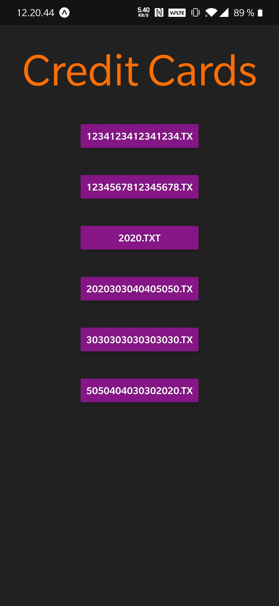

# portfolio-Magvib / Magnus Bjørn Nielsen

## Credit Card System
### Here we have the menu

### Here we have the the list taken from the NodeJS/ExpressJS Database.

### Here we have the information from one of the reditcards.

## CCMobile
### Here we have the mobile version of the Credit Card System

<!--  -->

## Credit Card System
### Here we have the Home Menu

### Here we have the information from one of the reditcards like in the C# vertion.

### We can also delete a file from the system.

## BiblioteksProject

## Guess Game

## Magic8Ball

